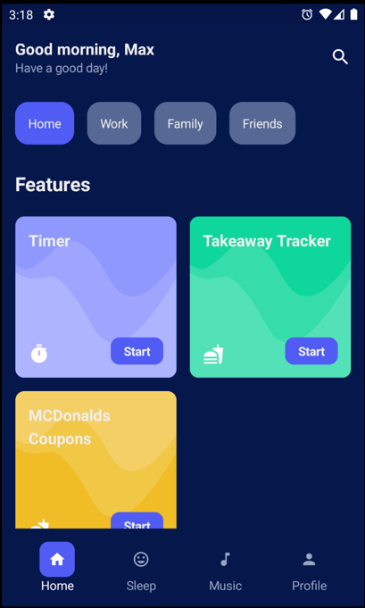
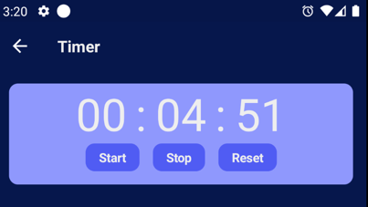
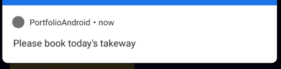
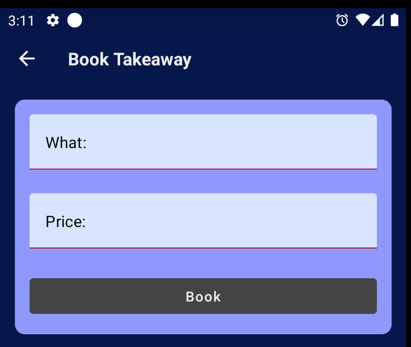
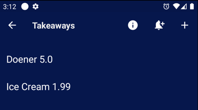
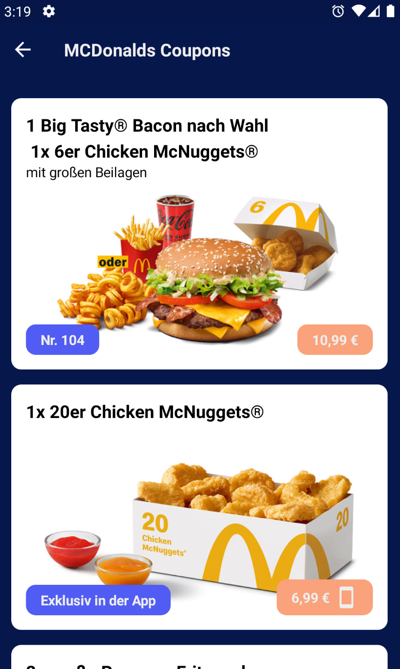

# portfolio-android

## Features

* Technical
  * Fully written in Kotlin, AndroidX und Jetpack Compose
  * Android build-scripts with Kotlin-DSL
  * Localized in English and German
  * Check maven dependency updates with [gradle-versions-plugin](https://github.com/ben-manes/gradle-versions-plugin)

* Home-Screen with shortcuts to different app features
  

* Timer
  
  * Count time timer, that supports Hours, Minutes and Seconds
  * Shows remaining seconds in a notification (Foreground Service)
  * Preserves the state of the timer when the app is closed

* Takeaway Tracker
  * Daily notification to remind you to track your takeaway
    
    * Click navigates to book screen
    * Back button than navigates to list screen
  * Track your takeaway
    
    * Form-Validation
  * List of tracked takeaways
    
  * Storage implementations:
    * In-Memory
    * Server-Based (with REST-Service) => TODO

* MCDonalds Coupons
  
  * Uses the JSON-data from mcdonalds.de to show the current coupons

## References

* Design based on [Meditation UI of Philipp Lackner](https://www.youtube.com/watch?v=g5-wzZUnIbQ)
